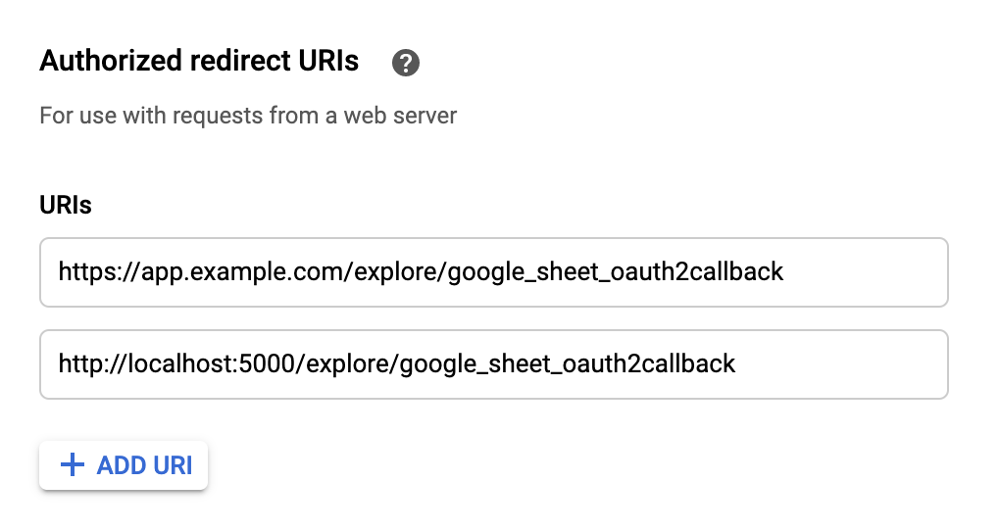

# Mara Data Sets

A minimal Flask based UI for providing raw data access to analysts, data scientists and power users of a data warehouse. Allows segmentations based on single columns of a flat table with quick data exploration, distribution charts and CSV downloads.

&nbsp;

## Visualizing fact tables

No matter how powerful the reporting frontend of a data warehouse, many users want to have direct access to raw data without having to use SQL on the database directly. This can be 

- BI product managers debugging data problems, 
- analysts needing raw data for their Excel data analysis, 
- machine learning engineers needing data sets for training models
- marketeers wanting to integrate with 3rd party data platforms

&nbsp;

This is an example of a flat table `gh_dim.repo_activity_data_set` from the [mara example project](https://github.com/mara/mara-example-project):

```
example_project_dwh=#  select * from gh_dim.repo_activity_data_set order by random() limit 10;
    Date    | Repo ID  |       User        |       Repo       | # Forks | # Commits | # Closed pull requests 
------------+----------+-------------------+------------------+---------+-----------+------------------------
 2018-05-12 | 8986340  | superchen14       | leetcode         |         |         1 |                       
 2018-01-05 | 17938434 | TSSSaver          | tsschecker       |       1 |           |                       
 2018-04-07 | 1091327  | MichaelStedman    | HelloWorldC      |         |         1 |                       
 2018-07-27 | 22000869 | zhangjiuyang1993  | zjy-redis-demo   |         |         1 |                       
 2018-05-08 | 17099521 | jakqui            | TurboERP_backend |         |         1 |                       
 2018-05-10 | 18963607 | rakesh9700        | KTJ-ASSGNMNT-1   |       1 |           |                      2
 2018-02-14 | 4536360  | OpenConext        | Stepup-Deploy    |         |         2 |                       
 2017-08-19 | 17837190 | EspeonOfEspeonage | e621bot          |         |         5 |                      2
 2017-12-27 | 2219655  | kairen            | ikm-ansible      |         |         2 |                       
 2017-08-15 | 6375048  | irying            | c-notes          |         |         1 |                       
(10 rows)
```

This is that table viewed through the data sets UI:


In the top right panel, arbitrary filters on date, text and numeric columns can be defined and their individual selectivity on the whole data set is shown. In the preview panel below, users can browse through individual rows. Output columns can be selected in the panel on the left, sorting is done by clicking on column headers, and individual cell values can be clicked for filtering the data set. Below the preview panel, the distributions of the selected columns across the data set and considering the current filters is shown.  

Combinations of filters can be saved as a query for later reference. And queries can be downloaded to CSV for further processing in any other tool.

&nbsp;

## Integrating and configuring data sets

See the [mara example project](https://github.com/mara/mara-example-project) for how to integrate this feature into a Flask application. Individual data set tables are configured like this (see [app/data_sets.py](https://github.com/mara/mara-example-project/blob/master/app/data_sets.py)):

```python
import data_sets.config
import data_sets.data_set
from mara_app.monkey_patch import patch


@patch(data_sets.config.data_sets)
def _data_sets():
    return [
        data_sets.data_set.DataSet(
            id='github-repo-activity', name='Github repo activities',
            database_alias='dwh', database_schema='gh_dim', database_table='repo_activity_data_set',
            default_column_names=['Date', 'User', 'Repo',
                                  '# Forks', '# Commits', '# Closed pull requests'],
            use_attributes_table=True),
        
        # .. more data sets

    ]
```

## Uploading data sets to Google sheets

For enabling this feature, add the `google_auth_oauthlib` and `google-api-python-client` packages as a dependency to your project. 

Then set the required Google client authorization credentials as in the example below.

```python
import data_sets.config
from mara_app.monkey_patch import patch


@patch(data_sets.config.google_sheet_oauth2_client_config)
def google_sheet_oauth2_client_config():
    """The client configuration as it originally appears in the client secrets file in json format"""
    return {"web": {
        "client_id": "...",
        "project_id": "...",
        "auth_uri": "...",
        "token_uri": "https://oauth2.googleapis.com/token",
        "auth_provider_x509_cert_url": "https://www.googleapis.com/oauth2/v1/certs",
        "client_secret": "...",
        "redirect_uris": ["..."]}
    }
```

This will enable the `Google sheet` export action button on the top right of the UI.


#### Google OAuth consent screen configuration

Before setting up such credentials, the configuration of the application's [OAuth consent screen](https://console.developers.google.com/apis/credentials/consent) is required.

The following `Scopes for Google APIs` are required for the integration:
* email
* profile
* openid
* ../auth/spreadsheets
* ../auth/drive.file

Configure the `Authorised domains` of the [consent screen](https://console.developers.google.com/apis/credentials/consent) as the domains that your applications' links are hosted on (i.e. project-a.com).

Fill the `Application Homepage` and the `Application Privacy Policy` links, shown on the consent screen. Must be hosted on an `Authorized Domain`.

#### Google OAuth 2.0 Client ID credentials setup

For setting up the required Google OAuth 2.0 [credentials](https://console.developers.google.com/apis/credentials),
see the official Google guide [here](https://github.com/googleapis/google-api-python-client/blob/master/docs/oauth-web.md).

Configure the OAuth 2.0 Client ID's `Authorised redirect URIs` with the 
authorization callback uris of the Mara Data sets application
in the form of `https://app-domain/data-sets/google_sheet_oauth2callback` and as in the example below.
Consider including localhost paths for ease of local developing and testing.



Download the Google OAuth 2.0 Client ID credentials in JSON format
and use the content to provide configuration for the `data_sets.config.google_sheet_oauth2_client_config`.